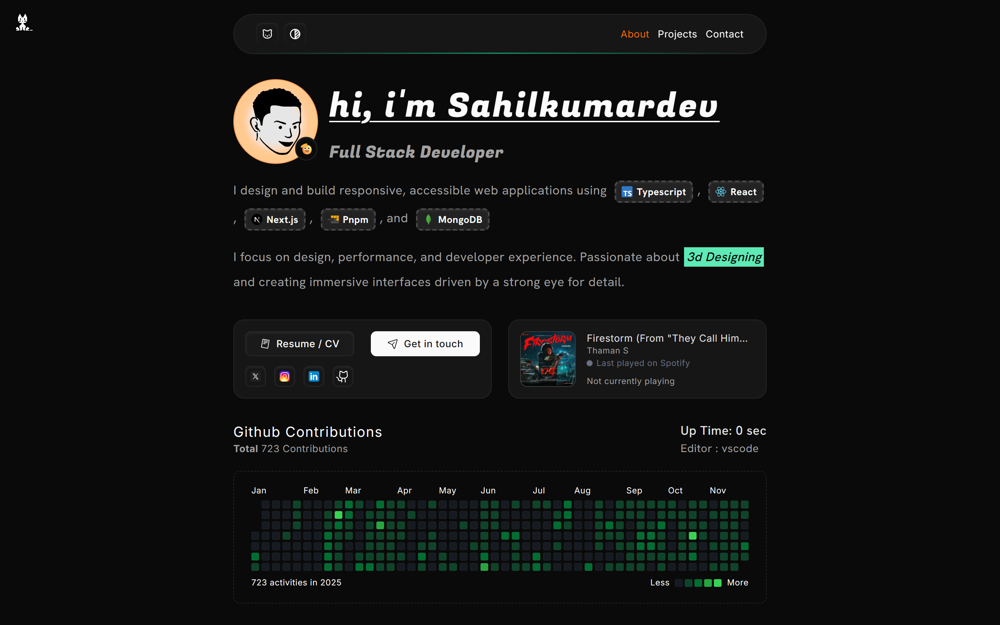
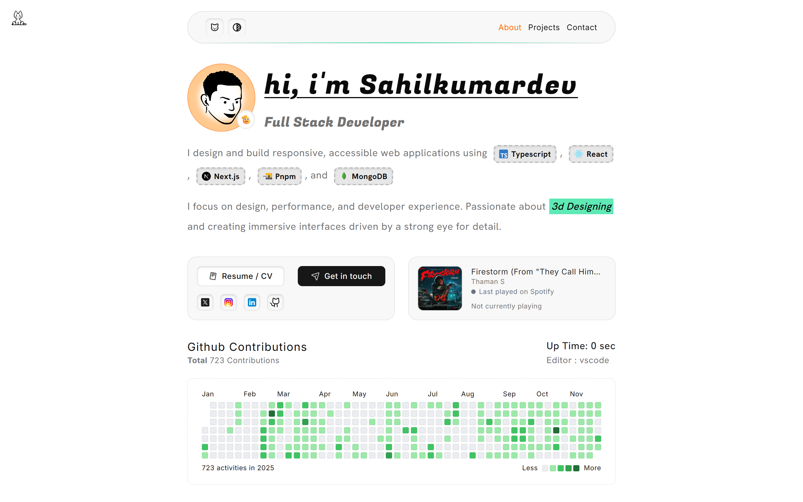
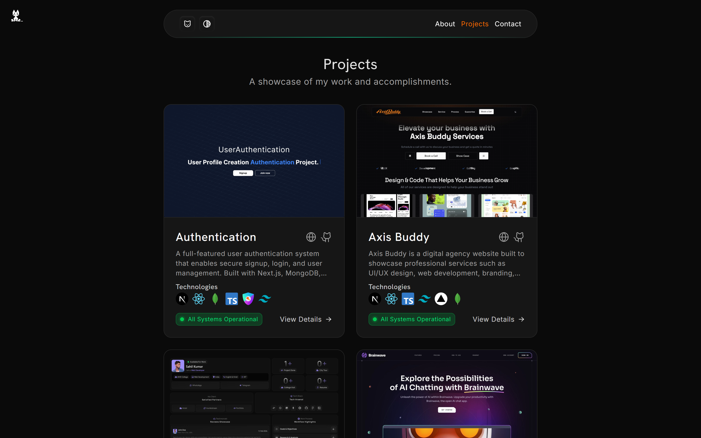
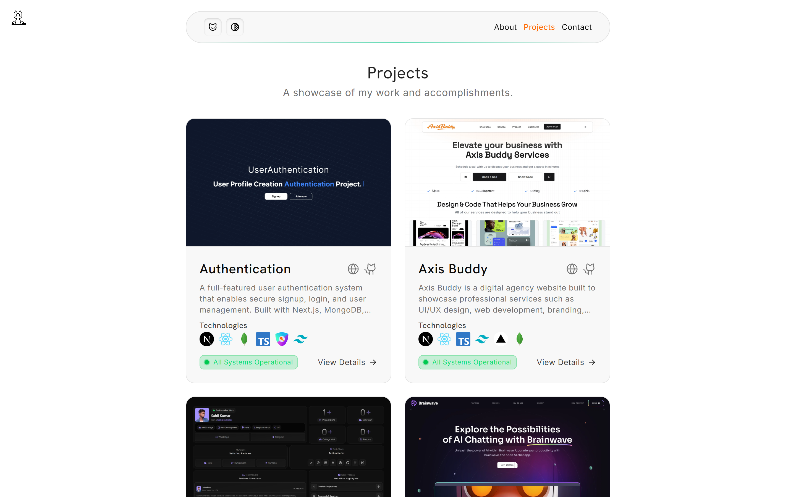

<div align="center">
  <h1>🚀 Dev Portfolio</h1>
  <p><strong>A modern, responsive developer portfolio built with Next.js 16, React 19, and Tailwind CSS 4</strong></p>
  
  <p>
    <a href="https://sahilkumardev.com">View Demo</a>
    ·
    <a href="https://github.com/sahilkumardev/dev-portfolio/issues">Report Bug</a>
    ·
    <a href="https://github.com/sahilkumardev/dev-portfolio/issues">Request Feature</a>
  </p>


</div>

---

## ✨ Features

- 🎨 **Modern UI/UX** - Clean, minimalist design with smooth animations using Motion
- 🌓 **Dark/Light Mode** - Seamless theme switching with next-themes
- 📱 **Fully Responsive** - Optimized for all device sizes
- ⚡ **Blazing Fast** - Built on Next.js 16 with optimized performance
- 🎭 **View Transitions** - Smooth page transitions using next-view-transitions
- 🐱 **Interactive Cat Cursor** - Fun animated cat that follows your cursor
- 🎵 **Spotify Integration** - Display your currently playing track
- 📊 **GitHub Activity** - Show your contribution graph
- 📝 **MDX Projects** - Write project documentation in MDX
- 📧 **Contact Form** - Integrated contact form with Telegram notifications
- 🔄 **Smooth Scrolling** - Lenis smooth scroll implementation

---

## 📸 Screenshots

<table>
  <tr>
    <td align="center" width="50%">
       
    </td>
    <td align="center" width="50%">
      
    </td>
  </tr>
  <tr>
    <td align="center" width="50%">
       
      </td>
    <td align="center" width="50%">
       
    </td>
  </tr>
</table>

---

## 🛠️ Tech Stack

| Category              | Technologies                  |
| --------------------- | ----------------------------- |
| **Framework**         | Next.js 16, React 19          |
| **Language**          | TypeScript 5                  |
| **Styling**           | Tailwind CSS 4, CSS Variables |
| **UI Components**     | Radix UI, Lucide Icons        |
| **Animation**         | Motion (Framer Motion)        |
| **Content**           | Fumadocs MDX                  |
| **Form Handling**     | React Hook Form, Zod          |
| **Code Highlighting** | Shiki                         |
| **Notifications**     | Sonner                        |
| **Scroll**            | Lenis                         |

---

## 🚀 Getting Started

### Prerequisites

- Node.js 18+
- pnpm (required - enforced via preinstall script)

### Installation

1. **Clone the repository**

   ```bash
   git clone https://github.com/octacn/sahilkumardev/dev-portfolio.git
   cd dev-portfolio
   ```

2. **Install dependencies**

   ```bash
   pnpm install
   ```

3. **Set up environment variables**

   ```bash
   cp .env.example .env.local
   ```

   Configure the following variables:

   ```env
   # Spotify API (for Now Playing feature)
   SPOTIFY_CLIENT_ID=
   SPOTIFY_CLIENT_SECRET=
   SPOTIFY_REFRESH_TOKEN=

   # Telegram (for Contact Form notifications)
   TELEGRAM_BOT_TOKEN=
   TELEGRAM_CHAT_ID=

   # GitHub (for Activity Graph)
   GITHUB_TOKEN=
   ```

4. **Run the development server**

   ```bash
   pnpm dev
   ```

5. **Open [http://localhost:3000](http://localhost:3000) in your browser**

---

## 📜 Available Scripts

| Command                | Description                 |
| ---------------------- | --------------------------- |
| `pnpm dev`             | Start development server    |
| `pnpm build`           | Build for production        |
| `pnpm start`           | Start production server     |
| `pnpm lint`            | Run ESLint                  |
| `pnpm format`          | Format code with Prettier   |
| `pnpm project:build`   | Build project assets        |
| `pnpm project:capture` | Capture project screenshots |

---

## 🎨 Customization

### Site Configuration

Edit `lib/config.tsx` to customize:

```tsx
export const siteConfig = {
  name: "your-username",
  url: "https://your-domain.com",
  developer: "Your Name",
  githubUsername: "your-github",
  social: {
    twitter: "https://twitter.com/your-handle",
    github: "https://github.com/your-username",
    linkedin: "https://linkedin.com/in/your-profile",
    // ... more social links
  },
};
```

### Adding Projects

1. Create a new MDX file in `content/docs/`
2. Add project metadata and content
3. Screenshots are automatically captured using Puppeteer

---

## 🤝 Contributing

Contributions are welcome! Please feel free to submit a Pull Request.

1. Fork the repository
2. Create your feature branch (`git checkout -b feature/amazing-feature`)
3. Commit your changes (`git commit -m 'Add some amazing feature'`)
4. Push to the branch (`git push origin feature/amazing-feature`)
5. Open a Pull Request

---

## 📄 License

This project is open source and available under the [MIT License](LICENSE).

---

## 👤 Author

**Sahil Kumar Dev**

- Website: [sahilkumardev.com](https://sahilkumardev.com)
- GitHub: [@sahilkumardev](https://github.com/sahilkumardev)
- Twitter: [@sahilkumardev](https://twitter.com/sahilkumardev)
- LinkedIn: [sahilkumardev](https://linkedin.com/in/sahilkumardev)

---

<div align="center">
  <p>⭐ Star this repository if you find it helpful!</p>
  <p>Made with ❤️ using Next.js</p>
</div>
